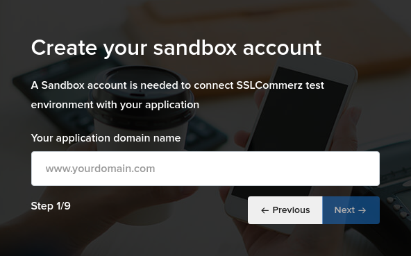
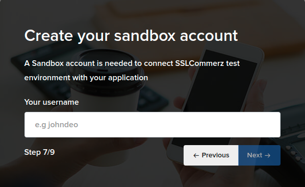
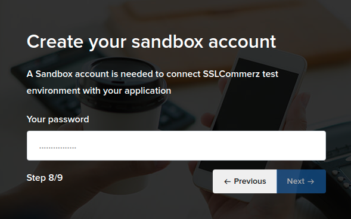
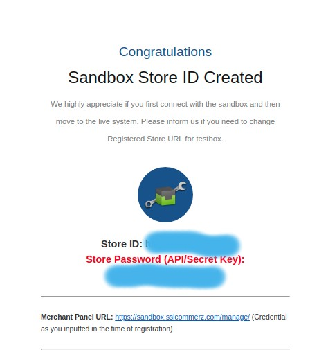
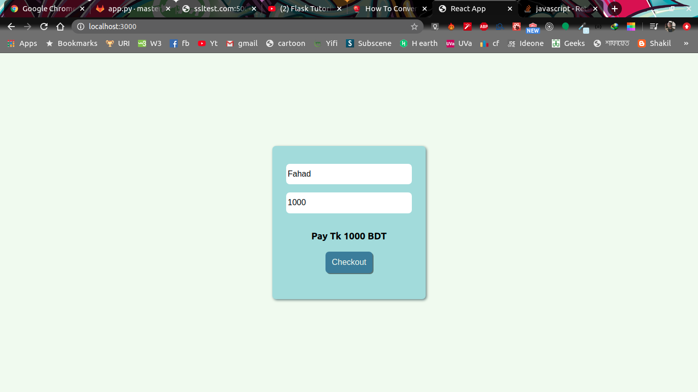
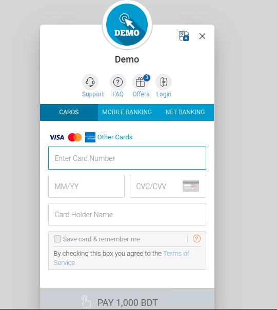
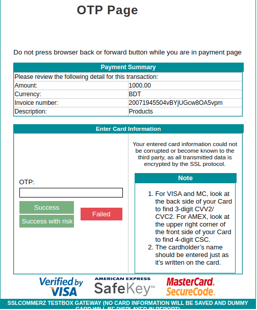
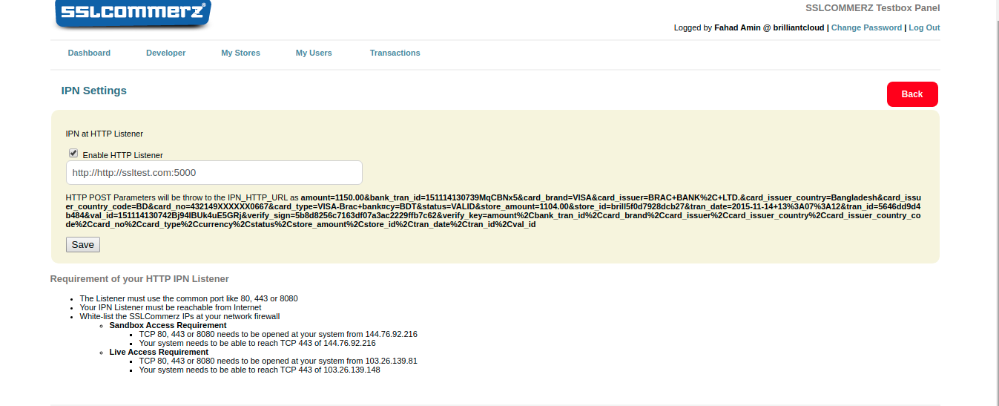

# SSLCOMMERCE integration with react frontend and flask backend application
---
SSLCOMMERCE documentation is kind of desiged for php monolith project, it's a step by step guide for sslCommerz payment integration for flask backend and react front end.


#### step1: create a sslCommerz sandbox account. You can create an account [here](https://developer.sslcommerz.com/registration/)
---
we'll use a sandbox environment for our testing purpose. For real transactions we'll just need to modify the sslCommerz api url. You can read about it [here](https://developer.sslcommerz.com/doc/v4/#payment-process-environment)

while creating a sandbox account you'll be asked to provide your domain name \


incase you don't have a domain you can edit your **/etc/hosts** file if you are on linux. for windows user run notebook as administrator and open **C:\Windows\System32\drivers\etc\hosts**. add **127.0.0.1&nbsp;&nbsp;&nbsp;&nbsp;\<your preferred domain name>**. for this example I'll use `sslTest.com` as my localhost domain. I will add **127.0.0.1&nbsp;&nbsp;&nbsp;&nbsp;`sslTest.com`** at the end of my hosts file.
insert demo Company name, address and everything as you want but provide your valid email address. 




remember these two fields. You'll need these to log into your marchet account.

take a screentshot of the whole registration data for further use.

After completing the registration, shortly you'll get a mail with your SSLCOMMERZ credentials.
after varifying your email address you'll get a mail with your credentials.
.
you'll need your id and password to log into your marchent panel and to use the api.


#### step 2: front-end setup


in our react app we have a simple app that receive user name and amount user will pay and send a request post request to `http://sslTest:5000/get-ssl-session` with 
```javascript
    const data = {
    name, credit
    }
```

#### step 3: backend setup
create an endpoint in your flask app where you want to send your payment information.

you need to provide some paramet to the sslCommers api.
here I am giving a basic setup example. for more customization like emi and discount please visit the SSLCOMMERZ documentation.

```python
def get_session(name, credit):
    post_data={
    "store_id": "<your id>",
    "store_passwd": "<your password>",
    "total_amount": credit,
    "currency": "BDT",
    "tran_id": "<a unique transaction id>",
    "success_url": "<where the the api will post data if the request is successful>",
    "fail_url": "<where the the api will post data if the request is failed>",
    "cancel_url": "<where the the api will post data if the request is canceled>",
    "cus_name": "<customer name>",
    "cus_email": "cust@yahoo.com",
    "cus_add1": "Dhaka",
    "cus_add2": "Dhaka",
    "cus_city": "Dhaka",
    "cus_state": "Dhaka",
    "cus_postcode": "1000",
    "cus_country": "Bangladesh",
    "cus_phone": "01711111111",
    "cus_fax": "01711111111",
    "ship_name": "Customer Name",
    "ship_add1": "Dhaka",
    "ship_add2": "Dhaka",
    "ship_city": "Dhaka",
    "ship_state": "Dhaka",
    "ship_postcode": "1000",
    "ship_country": "Bangladesh",
    "multi_card_name": "mastercard,visacard,amexcard",
    "value_a": "ref001_A",
    "value_b": "ref002_B",
    "value_c": "ref003_C",
    "value_d": "ref004_D",
    "shipping_method": "YES",
    "product_name": "credit",
    "product_category": "general",
    "product_profile": "general"
    }

    response = requests.post(SSLCZ_SESSION_API, post_data)

    return(response.json()["sessionkey"],response.json()["GatewayPageURL"])
```

the parameters are pretty self explanatory, you can tweak them as you prefer. however in my exaple I am just providing customer name and amount of money dynamicall. aslo notice the **success_url, fail_url, cancel_url** these domains should be valid and must have the capability to receive Post data. In this case I set these domain to **`ssltest.com:5000/<success/fail/cancel>`** accordingly. 
Here `ssltest.com` point to my localhost and my flask app is running on port **5000**.
if the request is successful we'll receive a response from which we'll use the **GatewayPageURL** to redirect our user to the payment gateway page.


#### step4: conmmunication between front end and backend.

after our react app sends customer name and credit to our backend, backend will return a url which we'll use to redirect our user . 

in this example *sslbackend/app.py* I added an end point **/get-ssl-session** that receives customer name and payment amount. it calls the get_session_data function and if the request is successful returs the gatewayPageUrl to front end.

```python
@app.route('/get-ssl-session',methods = ['POST'])
def get_ssl_session():
    name = request.get_json().get("name");
    amount = request.get_json().get("credit")

    session, gateway = get_session(name, amount);
    
    return jsonify({"session": session, "gatewayPageUrl":gateway}) 

```

we use receive the data at front end and redirect user to url .

```javascript
      Axios.post('/get-ssl-session', data)
      .then(resp=>{
        window.location.replace(resp.data.gatewayPageUrl);
      })
      .catch(err=>{
        console.log(err.response)
      })
```

here notice, we are redirecting user using the windows.location.replace() instead of history.push or redirect because we are redirecting to a diffrent domain.

after redirected to the gatewayPageUrl you'll get a page like this.



after choosing any method you'll be redirected to this page



in this page you can see three options **Success , Failed and Success with risk**
these three buttons emulate the successful or failed transaction scenario.

before we procced we have to setup our marchent account.and where we want to send our data after any transaction.

go to this page [manage marchent account](https://sandbox.sslcommerz.com/manage/) and login with your marchent account credentials that you provided during registration.

in your marchent panel go to **My Stores** section. You'll see list of your stores. select **IPN Settings**.

you'll see a page like this.


tick the Enable HTTP Listener option and enter the address of your backend.
For this project I entered `http://http://ssltest.com:5000`. click the save button, and we now we'll receive a response in our fail, cancel or success url after every transaction.

we set our listerner urls to this:
```python
    "success_url": "http://ssltest.com:5000/success",
    "fail_url": "http://ssltest.com:5000/fail",
    "cancel_url": "http://ssltest.com:5000/cancel",
```
now time to handle this urls. I'll discuss only success_url, ohter urls work the same way.

```python
@app.route('/success',methods = ['POST'])
def success():
    response = request.form
    # process your data store it or do anything you prefer

    return redirect('http://localhost:3000/success');
```

the success url recieves form data from SSLCOMMERZ as we set in the marchent account.
now notice we are using **request.form** because SSLCOMMERZ is sending form data.
**request.json() won't work in this case**.

after getting the response you can filter and store data as you want. 
after that redirect use to a success/fail/cancel page accordingly.
Here I am redirecting to my react success page.


**if you understood the basic you can take a look at the [sslcommerz-python](https://pypi.org/project/sslcommerz-python/) package, it's a handy package for quick SSLCOMMERZ setup on python backend**

That's all for basic setup. This should be good enought for small projects. For more advance setup you can visit the the SSLCOMMERZ [Documentation](https://developer.sslcommerz.com/doc/v4/).